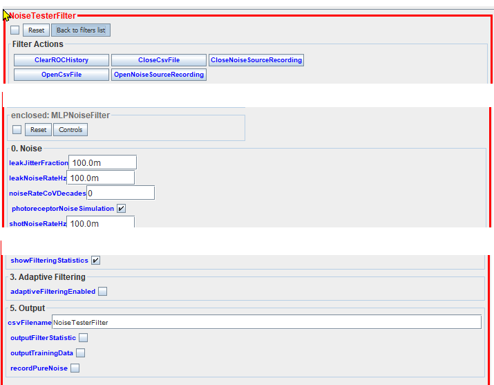
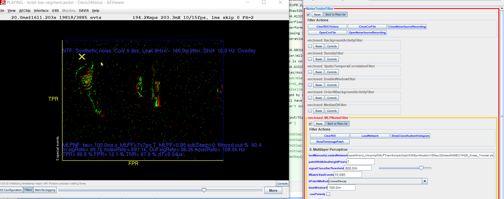

This code trains new floating point and quantized multilyaer perceptron denoising filters.

Please see the [main site for Denosing DVS 2021](https://sites.google.com/view/dnd21/home?authuser=0),

**Note:** Code includes pycharm run configuration files to run some of the scripts with default parameters.

To train a new MLP for denoising, there are 3 main steps:
1. collect  the training  data, 
2. Set up the environment
2. Train the network  
3. Test the accuracy on test set data
4. Convert the model to a .pb file for loading into jAER's _NoiseTesterFilter_
5. Convert a quantized model into hls4ml and RTL code

# Preparing training data

## Collecting training data
### From jAER
In [jaer](https://jaerproject.net), you can use  [_NoiseTesterFilter_](https://sites.google.com/view/dnd21/benchmarking?authuser=0) to output CSV data files from clean recordings that have labeled signal and noise events.



Play a clean recording, add noise to it using the NoiseTesterFilter noise parameters, or mix in real noise using the _OpenNoiseSourceRecording_ button. The enter a CSV file name and select the _outputTrainingData_ checkbox.

### From v2e
[v2e](https://sites.google.com/view/video2events/home) is our DVS simulator. It lets you generate synthetic clean data (but with motion blur and threshold mismatch nonidealities).

See [Synthetic Input](https://github.com/SensorsINI/v2e#synthetic-input) in the v2e github.

From v2e, you can generate aedat2 files that can be mixed with noise in NoiseTesterFilter to generate MLPF training data.

# Setup
 * Use python 3.10 conda env
```shell
cd MLPTrainScipts
conda create -n dnd_hls python=3.10
conda activate dnd_hls
pip install -r requirements.txt
```
 * Model can be trained using Tensorflow 2.11 on windows, but, Tensorflow 2.5 is required to convert the trained MLP to .pb file for use in jAER. See https://www.tensorflow.org/install/pip
 * See [requirements.txt](qmlpf/MLPTrainScripts/requirements.txt).

# Training a new denoising MLP

_qtrain_ takes input  from  the CSV files with the neighborhood age values and polarity 
values already stored in the csv file, while _qtest_ and _qtestaccelerate_ takes input from the txt file or npy file, which we generated from the hotel aedat txt file and the driving  aedat txt file that records only the (t,x,y,p,sig_or_noise_flag) info of the events.

1. For data used in the DND21 paper and the IISW paper, un-rar the archives 2xTrainingDataDND21test.rar and 2xTrainingDataDND21train.rar somewhere (they take about 1.8GB of disk space when uncompressed). These data combine the hotel-bar and driving datasets used in our publications.
2. cd MLPTrainScripts
3. update the dataset paths in qmlpf/MLPTrainScripts/qtrain.py and qmlpf/MLPTrainScripts/qtest.py. Assuming you run the scripts from MLPTrainScripts and have the datasets at qmlpf, then set
```
trainfilepath = '../2xTrainingDataDND21train'
testfilepath = '../2xTrainingDataDND21test'
```

Sample training run log
```text
C:\Users\tobid\anaconda3\envs\dnd_hls\python.exe "F:\tobi\Dropbox (Personal)\GitHub\SensorsINI\dnd_hls\qmlpf\MLPTrainScripts\qtrain.py" 1 32 
training MLP nodel with 
20 hidden units
7x7 input patch
using batch size 100, learning rate 0.0005, and 5 epochs
3000 699
training floating point model
2023-06-05 08:18:51.533326: I tensorflow/core/platform/cpu_feature_guard.cc:182] This TensorFlow binary is optimized to use available CPU instructions in performance-critical operations.
To enable the following instructions: SSE SSE2 SSE3 SSE4.1 SSE4.2 AVX AVX2 FMA, in other operations, rebuild TensorFlow with the appropriate compiler flags.
qbuild model... 0308pmfloatbin100tau32bitaw0MSEO1fH20_linear_7.h5
Model: "model"
_________________________________________________________________
 Layer (type)                Output Shape              Param #   
=================================================================
 input (InputLayer)          [(None, 98)]              0         
                                                                 
 fc1 (Dense)                 (None, 20)                1980      
                                                                 
 output (Dense)              (None, 1)                 21        
                                                                 
=================================================================
Total params: 2001 (7.82 KB)
Trainable params: 2001 (7.82 KB)
Non-trainable params: 0 (0.00 Byte)
_________________________________________________________________
No.0 newly-initialized net 0308pmfloatbin100tau32bitaw0MSEO1fH20_linear_7 loss: 0.26, acc: 0.29
checkpoint=<keras.src.callbacks.ModelCheckpoint object at 0x0000024DD7D4DBD0>
starting data generator
F:\tobi\Dropbox (Personal)\GitHub\SensorsINI\dnd_hls\qmlpf\MLPTrainScripts\qtrain.py:614: UserWarning: `Model.fit_generator` is deprecated and will be removed in a future version. Please use `Model.fit`, which supports generators.
  model.fit_generator(generator=traingenerator,
Epoch 1/5
2977/3000 [============================>.] - ETA: 0s - loss: 0.1001 - accuracy: 0.87133000 batches done
starting data generator
699 batches done
3000/3000 [==============================] - 48s 16ms/step - loss: 0.0999 - accuracy: 0.8715 - val_loss: 0.0838 - val_accuracy: 0.8900
Epoch 2/5
2976/3000 [============================>.] - ETA: 0s - loss: 0.0845 - accuracy: 0.88953000 batches done
...
3000/3000 [==============================] - 46s 15ms/step - loss: 0.0815 - accuracy: 0.8939 - val_loss: 0.1408 - val_accuracy: 0.8155
Epoch 5/5
2977/3000 [============================>.] - ETA: 0s - loss: 0.0791 - accuracy: 0.89703000 batches done
699 batches done
3000/3000 [==============================] - 46s 15ms/step - loss: 0.0790 - accuracy: 0.8971 - val_loss: 0.0724 - val_accuracy: 0.9049
meta NOT subset; don't know how to subset; dropped
C:\Users\tobid\anaconda3\envs\dnd_hls\lib\site-packages\keras\src\engine\training.py:3000: UserWarning: You are saving your model as an HDF5 file via `model.save()`. This file format is considered legacy. We recommend using instead the native Keras format, e.g. `model.save('my_model.keras')`.
  saving_api.save_model(
... quantizing model
  fc1 has not been quantized
  output has not been quantized
fc1 0
fc1 1
output 0
output 1
2001
fc1 0 (98, 20)
fc1 1 (20,)
output 0 (20, 1)
output 1 (1,)

Number of operations in model:

Number of operation types in model:

Weight profiling:
    ----------------------------------------
    Total Bits                     :     0

Weight sparsity:
WARNING:tensorflow:From F:\tobi\Dropbox (Personal)\GitHub\SensorsINI\dnd_hls\qmlpf\MLPTrainScripts\qkeras\estimate.py:347: Tensor.experimental_ref (from tensorflow.python.framework.ops) is deprecated and will be removed in a future version.
Instructions for updating:
Use ref() instead.
... quantizing model
  fc1 has not been quantized
  output has not been quantized
    ----------------------------------------
    Total Sparsity                 : 0.0000
saved model as 0308pmfloatbin100tau32bitaw0MSEO1fH20_linear_7model.h5
693it [00:39, 21.21it/s]699 batches done
699it [00:41, 17.03it/s]
predict all batch 699
0308pmfloatbin100tau32bitaw0MSEO1fH20_linear_7 auc 0.9582764916736216
meta NOT subset; don't know how to subset; dropped
(69874,) (69874,)
0308pmfloatbin100tau32bitaw0MSEO1fH20_linear_7.h5
testacc: 0.906431576838309
precision: 0.884629889944115
FPR: 0.08227585026528766
TPR: 0.8904918032786885
f1score: 0.8875511678304839
confusion matrix
[[37534  3365]
 [ 3173 25802]]
normalized confusion matrix
[[0.91772415 0.08227585]
 [0.1095082  0.8904918 ]]
meta NOT subset; don't know how to subset; dropped
total elapsed time 279.0 seconds

```
## to test accuracy of the latest model
We rewrote qtest to qtestaccelerate for accelerating the speed of generating the input for mlpf.

Un-rar the archived quantized-mlpf-runrocdata.rar and driytrue.rar and put the npy files under the same folder with the qtestaccelerate.py.
```
cd MLPTrainScripts
python qtestaccelerate.py dri 62000
```
 * dri, application, could be 'hotel'
 * 62000, number of batches for testing dvs event records, could use any number < 62000,

Output from test:
```text
C:\Users\tobid\anaconda3\envs\dnd_hls\python.exe "C:/Program Files/JetBrains/PyCharm 2020.1.4/plugins/python/helpers/pydev/pydevd.py" --multiprocess --qt-support=auto --client 127.0.0.1 --port 39949 --file "F:\tobi\Dropbox (Personal)\GitHub\SensorsINI\dnd_hls\qmlpf\MLPTrainScripts\qtestaccelerate.py" dri 1000 
Connected to pydev debugger (build 222.4554.11)
lastts 175121
2023-06-05 08:01:37.412390: I tensorflow/core/platform/cpu_feature_guard.cc:182] This TensorFlow binary is optimized to use available CPU instructions in performance-critical operations.
To enable the following instructions: SSE SSE2 SSE3 SSE4.1 SSE4.2 AVX AVX2 FMA, in other operations, rebuild TensorFlow with the appropriate compiler flags.
Model: "model"
_________________________________________________________________
 Layer (type)                Output Shape              Param #   
=================================================================
 input (InputLayer)          [(None, 98)]              0         
                                                                 
 q_activation (QActivation)  (None, 98)                0         
                                                                 
 fc1 (QDense)                (None, 10)                990       
                                                                 
 q_activation_1 (QActivatio  (None, 10)                0         
 n)                                                              
                                                                 
 fc2 (QDense)                (None, 1)                 11        
                                                                 
 output (QActivation)        (None, 1)                 0         
                                                                 
=================================================================
Total params: 1001 (3.91 KB)
Trainable params: 1001 (3.91 KB)
Non-trainable params: 0 (0.00 Byte)
_________________________________________________________________
software-0314-tanhmodel.h5
predict batch
F:\tobi\Dropbox (Personal)\GitHub\SensorsINI\dnd_hls\qmlpf\MLPTrainScripts\qtestaccelerate.py:872: UserWarning: `Model.predict_generator` is deprecated and will be removed in a future version. Please use `Model.predict`, which supports generators.
  initpredictions = model.predict_generator(testgenerator,steps=testbatches,verbose=1)
start generator
['driandrealshotnoiseevents.npy']
1000/1000 [==============================] - 5s 4ms/step
software-0314-tanhmodel.h5 driandrealshotnoiseevents.npy auc 0.8747858033121161
meta NOT subset; don't know how to subset; dropped
```

## to train floating point or quantized model
```
python qtrain.py 0 4
```
 * first parameter 0/1, 0 means quantized training, 1 means float training.
 * second parameter, 4 means quantized bits for inputs and activations before the last layer. the last layer have 16 bits. Use 32 for floating training.

The key code is in function qbuildModel

## To test the quantized model
This is the older, slower code that uses the CSV files. Use qtestaccelerate.py to test faster.

```
python qtest.py hotel 4
```
 * first parameter hotel/dri, hotel means using hotel dataset, dri means using driving dataset.
 * second parameter, 4 means quantized bits.

-4bitweights0308.h5 can be used for wkfiles1 in qtest.py

# To use the model in jAER for denoising

You can convert the .h5 model to a protobuf .pb file with the script [convertH5toPB.py](qmlpf/MLPTrainScripts/convertH5toPB.py):
```shell
python convertH5toPB.py 0308pmfloatbin100tau32bitaw0MSEO1fH20_linear_7model.h5
```
The resulting .pb file can be loaded into jAER's NoiseTesterFilter.

Sample output:
```shell
$ python convertH5toPB.py 0308pmfloatbin100tau32bitaw0MSEO1fH20_linear_7model.h5
2023-06-05 13:29:54.413293: I tensorflow/core/platform/cpu_feature_guard.cc:182] This TensorFlow binary is optimized to use available CPU instructions in performance-critical operations.
To enable the following instructions: SSE SSE2 SSE3 SSE4.1 SSE4.2 AVX AVX2 FMA, in other operations, rebuild TensorFlow with the appropriate compiler flags.
2023-06-05 13:29:54.603102: I tensorflow/compiler/mlir/mlir_graph_optimization_pass.cc:375] MLIR V1 optimization pass is not enabled
2023-06-05 13:29:54.615258: W tensorflow/c/c_api.cc:304] Operation '{name:'output/bias/Assign' id:44 op device:{requested: '', assigned: ''} def:{{{node output/bias/Assign}} = AssignVariableOp[_has_manual_control_dependencies=true, dtype=DT_FLOAT, validate_shape=false](output/bias, output/bias/Initializer/z
eros)}}' was changed by setting attribute after it was run by a session. This mutation will have no effect, and will trigger an error in the future. Either don't modify nodes after running them or create a new session.
output_names ['output/Sigmoid']
input_names ['input']
node: input
node: fc1/kernel/Initializer/stateless_random_uniform/shape
node: fc1/kernel/Initializer/stateless_random_uniform/min
node: fc1/kernel/Initializer/stateless_random_uniform/max
node: fc1/kernel/Initializer/stateless_random_uniform/StatelessRandomGetKeyCounte
.................
node: fc1/MatMul
node: fc1/BiasAdd
node: fc1/Relu
node: output/kernel
node: output/bias
node: output/MatMul
node: output/BiasAdd
node: output/Sigmoid
length of  node 11
*** wrote .pb model for jAER to ./2xpb//0308pmfloatbin100tau32bitaw0MSEO1fH20_linear_7model.pb

```
Loading this model into _MultilayerPerceptronNoiseFilter_ in jAER shows this on the _hotel-bar_ data segment, which can be obtained from our [gdrive DND21 data folder](https://sites.google.com/view/dnd21/datasets?authuser=0):



# Convert a quantized model into hls4ml and RTL code

See [hls4ml_model_generation](../hls4ml_model_generation)